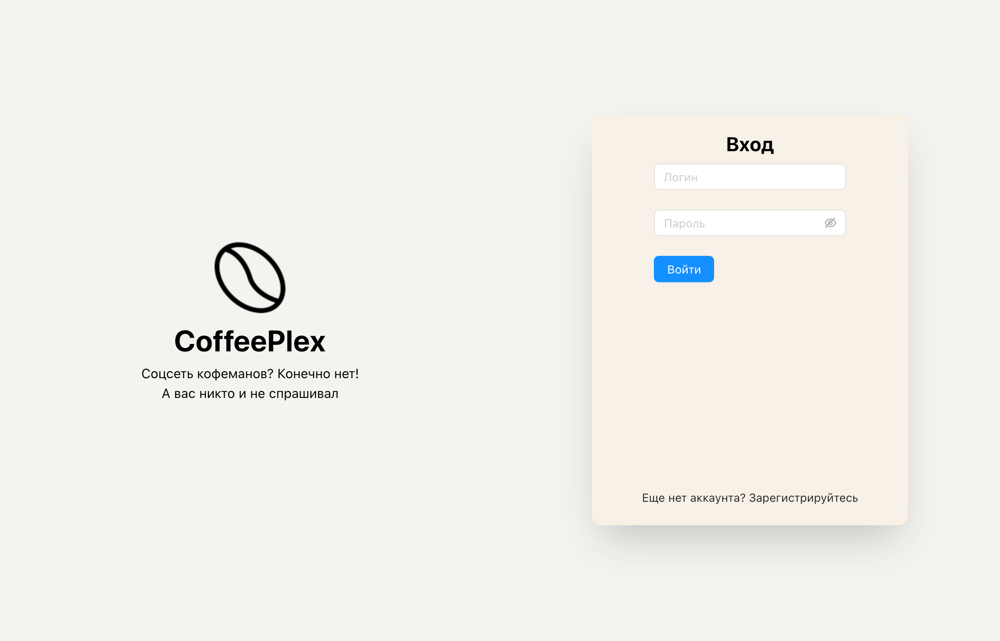
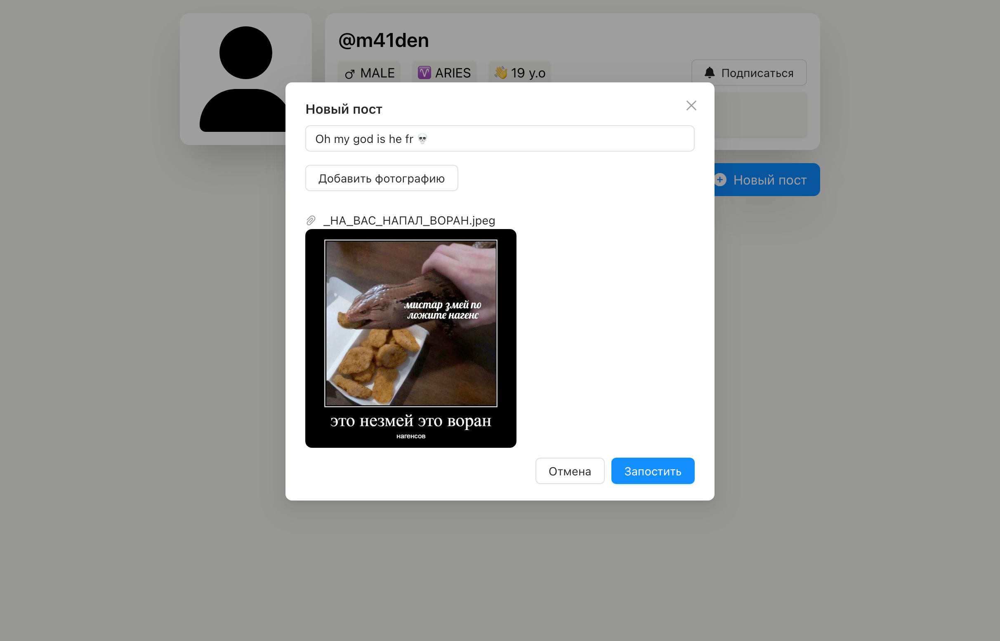
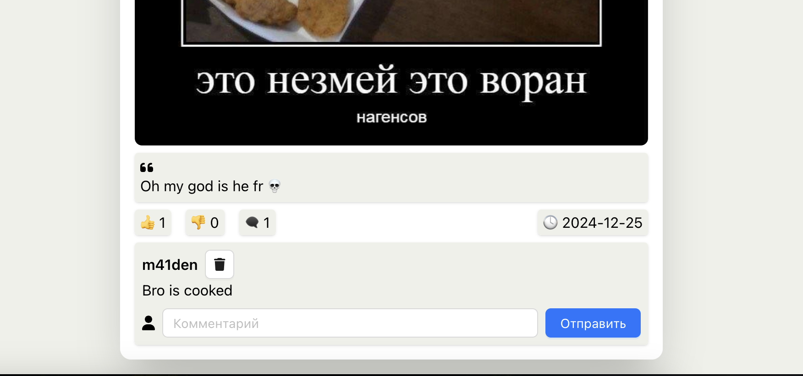

# ☕ CoffeePlex

### Еще один проект по Javа, из-за которого я её окончательно возненавидел

> [](https://www.java.com/ru/)
> [](https://tomcat.apache.org/)
> [](https://www.mysql.com/)  
> [](https://maven.apache.org/)
> [](https://www.jetbrains.com/idea/)

Эти бейджики автокомплитом вставились 👍

## Как запускать проект

1. сбилдить war файл как хотите, мне idea артефакты билдила
2. ```shell
    docker compose up -d
    docker compose exec db bash -c "mariadb -proot coffeeplex < /migrations/coffeeplex_schema.sql"
    docker compose restart
    cd frontend && pnpm i && pnpm dev
    ```

Если tomcat шалит и выплевывает ошибки, пните контейнер `docker compose restart app`

## А вот смешные скрины

|  |  |
|---------------------------|---------------------------|
|  |  |
